# Practica01---Mi-Blog
## Alejandro Enríquez
## **1. El repositorio se encuentra en GitHub y se llama Practica01---Mi-Blog.** 

### El repositorio se encuentra en GitHub.
## **2. Creación de 7 páginas html con el tema de un negocio de sistemas tecnológicos.**

## **3.	Comprobacion con la herramienta W3C**
### - contacto.html

### - about.html

### - index.html

### - noticia.html

### - producto.html

### - promo.html

### - ubicacion.html

#### Como podemos observar en ninguna página existe errores ni advertencias de ningun tipo.
## **4. Formato de las páginas HTML**
### Se usó el siguiente formato.
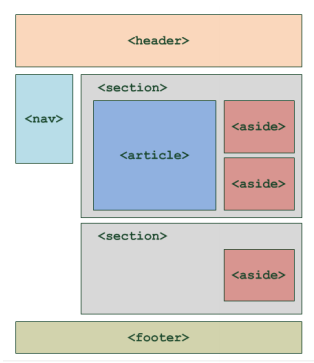
#### Dentro de la etiqueta '<header>' está el título de la página, el logo y el charset. Las demás etiquetas a excepción del <footer>, tienen el atributo ‘width’ que hace que el ancho de la página se divida en porcentajes, para poder hacer las columnas requeridas que en su mayoría serán 3. También se usa float, y se la direcciona a la izquierda, así todas se pondrán al lado de la anterior.
#### El logo en todas las páginas es un hipervínculo a la página principal, y en uno de los laterales se encuentra el menú de navegación que permite al usuario moverse de un punto a otro sin tener que pasar por el menú principal.
#### En la etiqueta <footer> se ponen los datos del programador y la leyenda de copyright.
La mayoría de las páginas siguen estrictamente este formato, otras tienen ciertas modificaciones.
### Las etiquetas giguen el formato designado
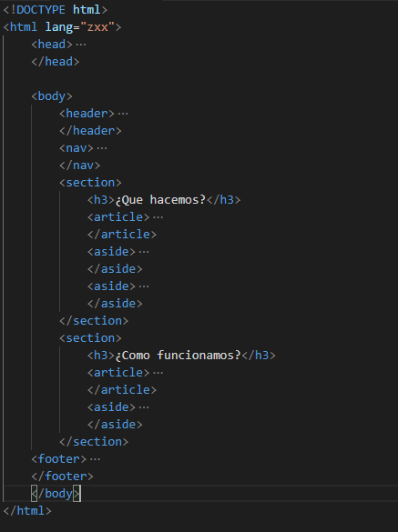
## **5.	Imágenes y rutas relativas.**
### Las imágenes son guardadas en una carpeta dentro del proyecto y son llamadas en el programa con la ruta 'imágenes/*.jpg'. Todas las imágenes funcionan así.
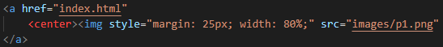
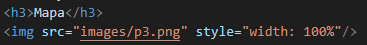
### En la primera imagen podemos ver el hipervínculo del log.
## **6. Tabla**
  ### La tabla se creó en la página de contacto.html y se realizó con la etiqueta <table> y con el atributo ‘rowspan’ y ‘colspan’ se define cuantas celdas deben tomar en filas y columnas. 
  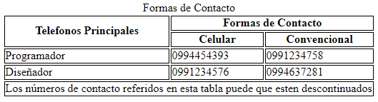
  ### La primera etiqueta de ‘Teléfonos Principales’ es la agrupación de 2 celdas verticalmente. Y la otra etiqueta de ‘Celular’ agrupa 4 celdas.
  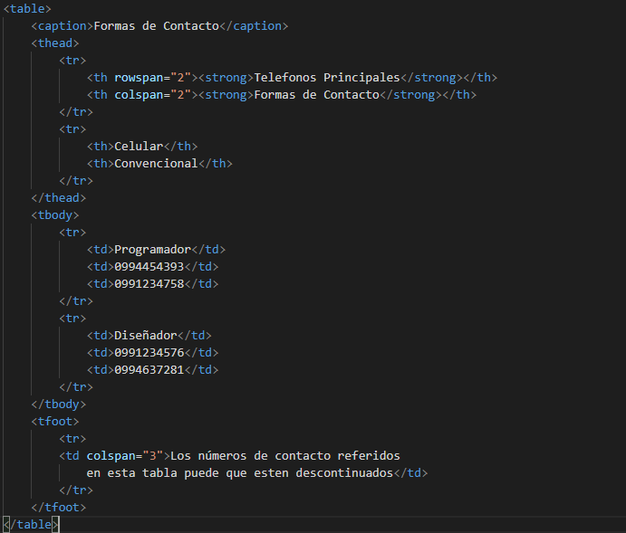
## **7.	Incrustar un video en Youtube.**
  ### En la página de ‘producto.html’ se enlazó un video de youtube con la etiqueta Iframe.
  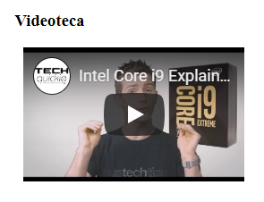
  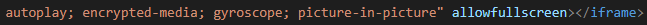  
## **8. Listas y etiquetas de texto**
  ### Las listas fueron utilizadas en diferentes páginas como por ejemplo en una serie de pasos a seguir. En otra página para poner una lista de las autoridades, y para menús. En todas las páginas se usan diversas etiquetas de modificación de texto.
  
  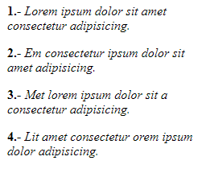
## **9. Navegación con ID**
  ### En la página de promociones se crearon 2 secciones con 3 artículos en cada una de ellas, cada artículo con un ‘id’ que lo usaremos para poder llamar al artículo con un hipervínculo de la siguiente manera.
  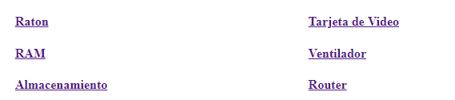
  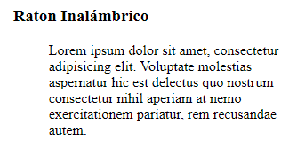
## **10. Blockquote**
  ### He utilizado otras etiquetas como por ejemplo <blockquote> que crea un margen para el párrafo, haciendo que se diferencie de los títulos. 
  
## **Resultados Obtenidos**
  ### Comprensión del uso de etiquetas para manejo de texto en html, creación de hipervínculos, listas y tablas. Adjuntar un video de youtube y organizar todas las etiquetas según lo deseado.
## **Conclusiones**
  ### Pude evidenciar la manera en la que funcionan las etiquetas de texto, listas, tablas entre otras. Los errores indicados por la herramienta W3C fueron fácilmente corregidos, como el atributo alternativo que hay que poner en todas las imágenes o el texto inicial en los articulos. Las imágenes e hipervínculos no presentaron ninguna dificultad.
## **Nombre del Estudiante: ** Alejandro Sebastian Enríquez Mancheno
## **Firma del Estudiante: **
  
### **Correo Institucional: ** aenriquezm2@est.ups.edu.ec
### **URL**
  ## Mi Blog: https://github.com/AlejoEnriquez2/Practica01---Mi-Blog.git
  ## Restaurant: https://github.com/AlejoEnriquez2/Tarea1

