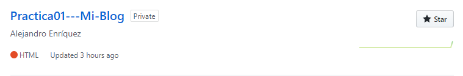
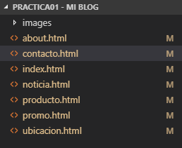
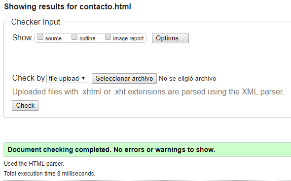
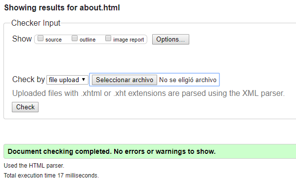
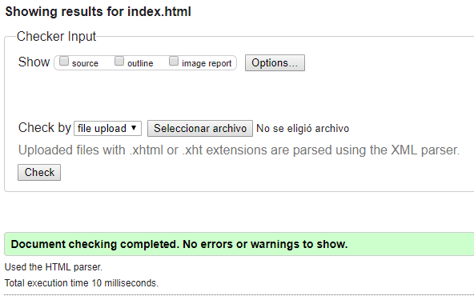
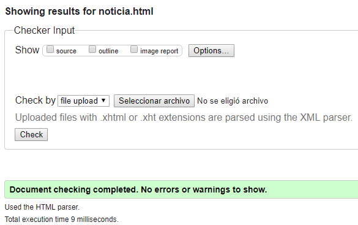
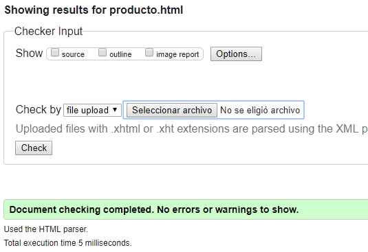
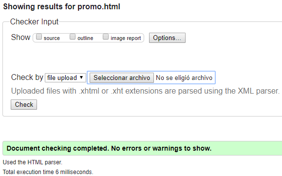
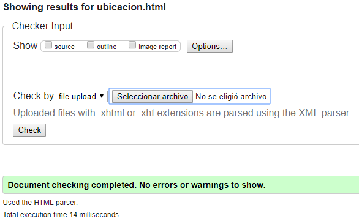

# Practica01---Mi-Blog
##Alejandro Enríquez
##**1. El repositorio se encuentra en GitHub y se llama Practica01---Mi-Blog.** 

###El repositorio se encuentra en GitHub.
##**2. Creación de 7 páginas html con el tema de un negocio de sistemas tecnológicos.**

##**3.	Comprobacion con la herramienta W3C**
###- contacto.html

###- about.html

###- index.html

###- noticia.html

###- producto.html

###- promo.html

###- ubicacion.html

